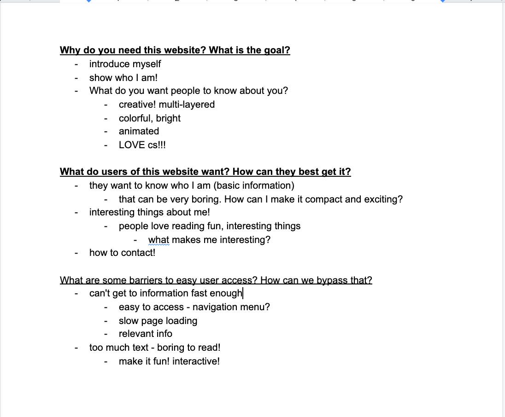
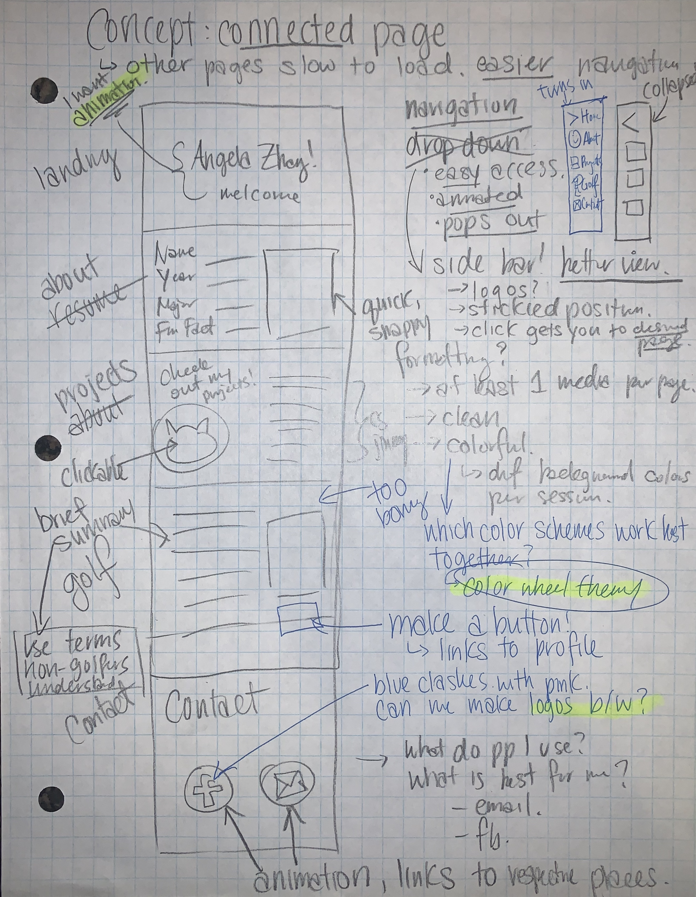
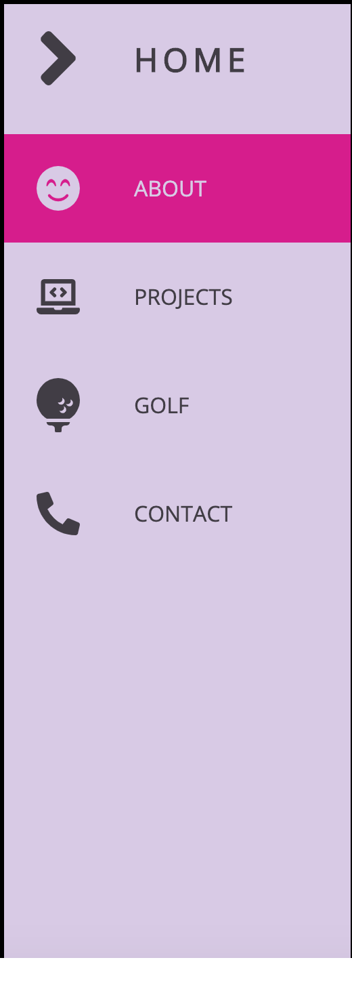
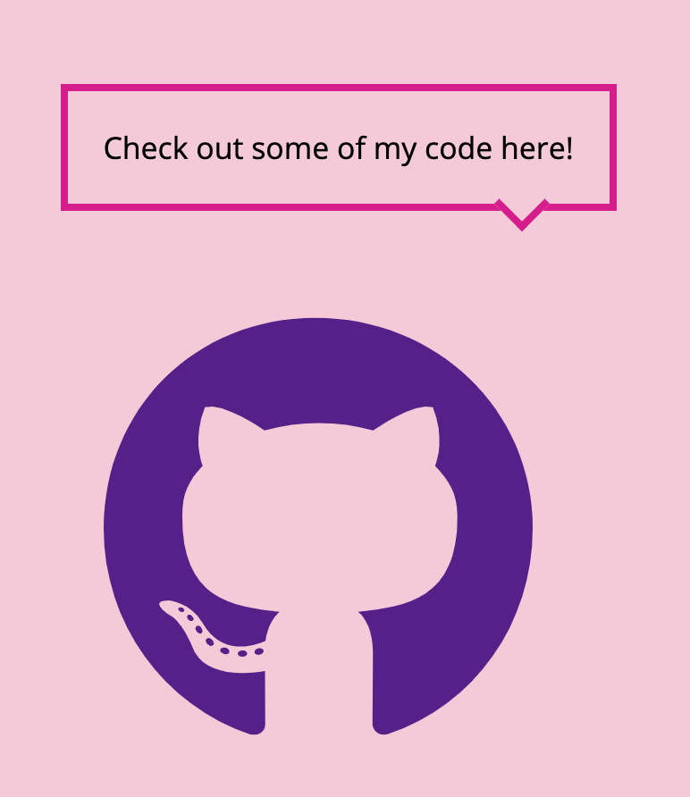
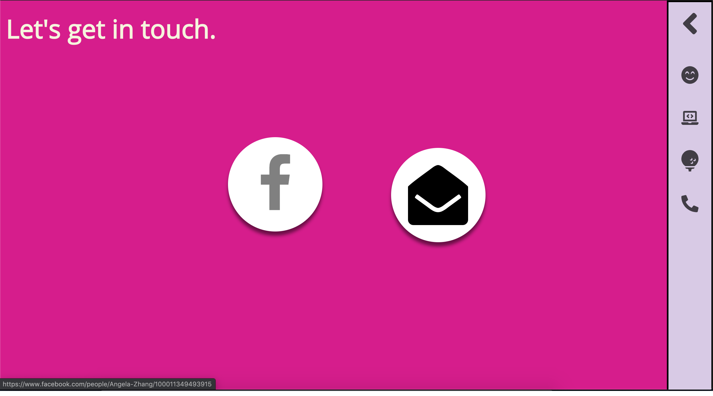

# This is my personal website written using CSS/HTML/JavaScript. 

This project was a lot of fun to build. It's bright, creative, interactive. The website can be reached here at https://www.angelazz.me.

## Design / User Interface 🚀

Before building the website, I jotted down a list of user interface questions. What is my goal with this website? What do the users want? What is the purpose? From thinking of those key questions first, it was easier to come up with ideas for my website.



My conclusion was that I wanted this website to represent me: my bubbliness, my passions, my interests. When the user opens the website, I want them to feel like the website embodies who I am.

After brainstorming, I drafted multiple potential layouts on paper and pencil, keeping in mind the questions I posed. I played around with multiple formats and revisited the ideas until I finally ended up with this version:



The idea behind this draft here is to make it as easy as possible for users to extract information about me in an easy, interactive way.

## Implementation Explained

The reason why I made the website one continuous page instead of the typical several pages is for easy access and user experience. My first drafts, when I had multiple pages, it was slow and not the most interesting. With one page, however, simply scrolling or clicking on the accessible side bar takes you directly to your desired section.

### Navbar

This was the most difficult element to implement on my website. I wanted a navigation bar that was off to the side, and not distracting, but not so small that you don't know it's there. I eventually settled on the width of 5rem (5 x 16px). 

Next was adding icons so I that when the bar collapses, people can see the icons representing the pages. Only when they hover over the navbar should the full bar appear, with text names of each page. I did this by changing the size of the navbar to reveal more of it when the mouse hovers over it, using css hover.

Following that, linking the navbar links were no problem. However, when I hovered over each bar, it was hard to see exactly what I was clicking. So, to fix this, I made it so that the page name you are hovering over turns a different color, like so:



### Home (Landing)

When people come to my website, they should immediately see my name. 
But just having my name "Angela Zhang" is too boring (even if I add colorful decorations and all that).
I wanted simplicity, but also something that is intriguing. 
That's why I settled on a nice animation sequence where my name is bold and in black, stretching out and collapsing back in.

I did so by writing animations in CSS. I made a @keyframes animation for both text growing big (my name) and also a fading and growing animation for the welcome line.

```
@keyframes text {
  0% {
    color: var(--bg1);
  }
  30% {
    letter-spacing: 20px;
  }
  85% {
    letter-spacing: 8px;
  }
}

@keyframes fadeInGrow {
  0% {
    opacity: 0;
    font-size: 0;
  }
  30% {
    font-size: 14px;
  }
  100% {
    opacity:1;
    font-size: 30px;
  }
}
```

### About

I put the about page right after the landing because when people first see a personal website, they want to see a picture and the most basic information about a person first. 
I wanted something quick and snappy. Big words, key information.
I made the picture and text next to each other using flexbot. I use flex for similar reasons in the following pages.

### Projects

I wanted the user to be able to easily access my github projects. I decided a link would be best to do so. I then got a github logo and made it so that clicking on the logo would take you to my github.
I also made a cool text-box above the github cat logo to make it look like the cat was talking. I did so using a text border box and another empty span box that I rotated to make the triangular shape at the bottom of the speech box. The result looked like this:



### Golf

Golf is a big part of my life, so I needed to include it, but also keep in mind that readers of the website might not understand golf jargon. I paid attention to simplifying my terminologies to ideas that people can digest.
Initially, I had two flexbot columns, one with text on one side, the other with a picture.
I felt that it was too boring, and needed some interactive elements, so I provided links to relevant articles for people to click on in the text and also a button next to the image that takes website users to my profile.
One problem I faced was clicking a link only to without it opening up a new tab. I fixed this by inserting target="\_blank". The html code looked as such:

```
<p>I am currently <a target="_blank" href="https://dartmouthsports.com/news/2020/2/17/athletics-cape-air-athletes-of-the-week-knight-and-zhang.aspx">the all-time record holder for women's golf in Dartmouth history</a>, and hold the best stroke average out of the team.</p>
```

### Contact

I wanted something simple yet elegant for the contact page. 
One aesthetic barrier I faced was that the facebook blue color clashed a lot with the violet pink background. To counter this, I decided to make both social media icons black with a white background. I did so by making a span and rounding its borders to make a white circular shape in the background. I then adjusted the icons themselves to be black for a black-and-white button.
I decided on using social media icons with a nice animation that makes the icon shift upward and gray-scale when you hover over them. 
The finished product looks something like this:



_Here, I am hovering over the facebook icon._

## Acknowledgments 🙏

I consulted these following sources for help on my project:

* Udemy, Fireship
* https://www.youtube.com/watch?v=Syg_9iB1vco (DarkCode)
* https://www.youtube.com/watch?v=pj9cRoyQfgA (Devinector)
* Pure scroll: https://www.youtube.com/watch?v=KbMJPNXYYnw&list=LLLH6IJEfgEKps8A4t8wqXvA&index=5&t=17s (Online Tutorials)
* Arrow box: https://www.youtube.com/watch?v=pgMIp4ghGr0 (Arjun Khara)
* Button: https://www.w3schools.com/howto/howto_css_text_buttons.asp
* Mail-to: https://css-tricks.com/snippets/html/mailto-links/
* social media buttons: https://www.youtube.com/watch?v=hqlu47FX_q8
* https://stackoverflow.com/questions/34082002/html-button-opening-link-in-new-tab/46542656

## Inspiration 
* https://blog.hubspot.com/marketing/best-personal-websites
